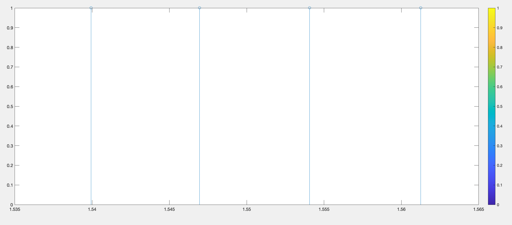
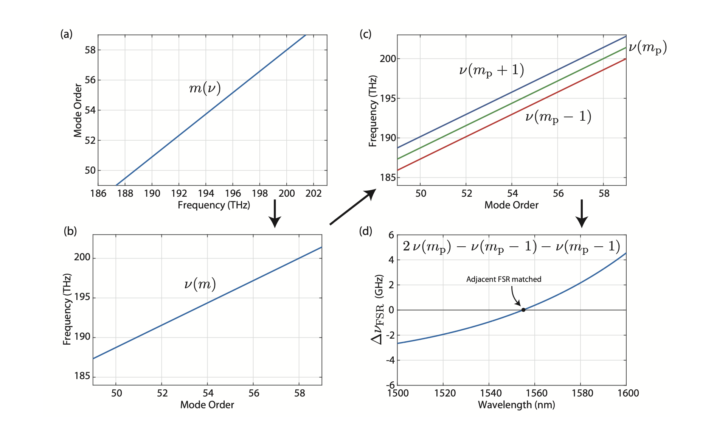

# plab_work_public
Repository for my simulation and analysis codes in BU Silicon Photonics Group

Majority of codes are in MATLAB and python.

## AL11a

These codes are concerned with some post-processing steps I did in Boston University's Photonics center cleanroom. The aim was to be able to simulate the resonance frequencies of a ring resonator with different cross-sections. 

## ringsolvers

These codes are used to calculate pretty much any relevant information you might want from a circular ring resonator, such as dispersion, effective index, quality factor, mode volume, FSR and four-wave mixing pair rate.

The dispersion is calculated using the discrete dispersion analysis method:

Sequence for proposed method of dispersion engineering a ring resonator including (a) numerical simulation of mode order versus frequencies, (b) inversion to have frequency versus mode order, (c) calculate frequency ± one mode order away, and (d) difference of these showing the difference in free spectral range versus wavelength.
